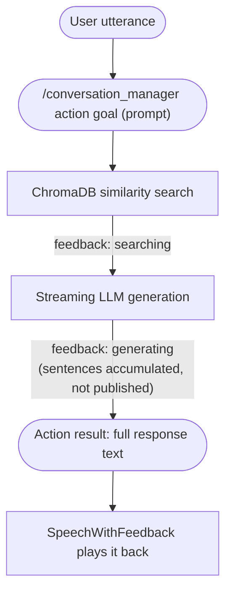
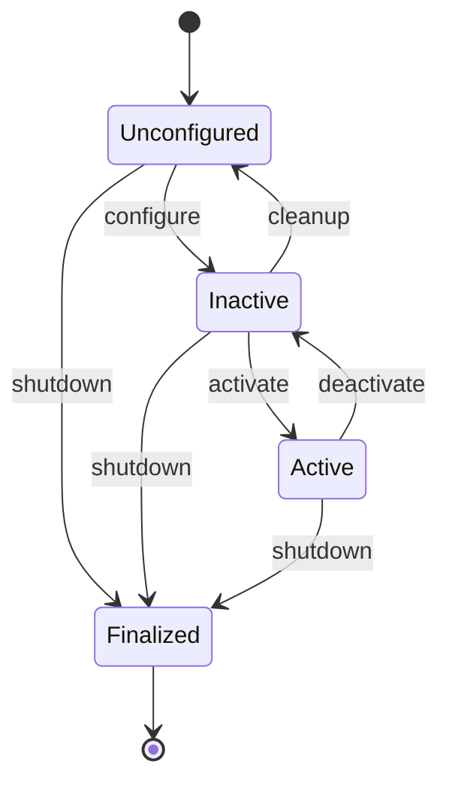

<div align="center">
<h1> Conversation Manager</h1>
</div>

<div align="center">
  
</div>

The **Conversation Manager Package** implements a **Retrieval-Augmented Generation (RAG)** system for the Pepper robot to serve as a lab assistant at the Upanzi Network, Carnegie Mellon University Africa. The system allows Pepper to answer questions about Upanzi Network's research, projects, facilities, and impact areas using a knowledge base built from structured JSON data.

## ✨ Key Features
- **ROS2 Native**: Built for ROS2 Humble
- **Retrieval-Augmented Generation**: Combines vector search with large language models for accurate, context-aware responses
- **ChromaDB Integration**: Local vector database for privacy-preserving knowledge storage
- **Configurable LLM Support**: Compatible with any OpenAI-compatible API (DeepSeek, Groq, etc.)
- **NAOqi-Ready Output**: Embeds ALTextToSpeech prosody tags in the response so the BT `SpeechWithFeedback` node can drive natural-sounding speech and contextual gestures via ALAnimatedSpeech
- **Conversation Memory**: Maintains context from previous interactions (configurable number of turns)
- **Multi-format Data Support**: Handles structured JSON knowledge bases and flat document lists
- **ROS2 Action Interface**: Action-based architecture for integration with other ROS2 nodes and the BehaviorTree controller, with feedback during processing

# 🛠️ Installation

## ✅ Prerequisites
- **ROS2 Humble** or newer
- **Python 3.8** or compatible version
- **ROS 2 installation** with `rclpy` support
- **Internet connection** for LLM API access (unless using local LLM)

## Package Installation

1. **Clone and Build the Workspace**
```bash
# Clone the repository (if not already done)
cd ~/ros2_ws/src
git clone https://github.com/yohatad/pepper4dec.git

# Build the workspace
cd ~/ros2_ws
colcon build --packages-select conversation_manager
source install/setup.bash
```

2. **Install Python Dependencies**
```bash
pip install -r ~/ros2_ws/src/pepper4dec/conversation_manager/requirements.txt
```

# 🔧 Configuration Parameters
The configuration is managed via `config/converation_manager_configuration.yaml`. The file must be present for the node to start.

| Parameter                        | Description                                                      | Range/Values     | Default Value                       |
|----------------------------------|------------------------------------------------------------------|------------------|--------------------------------------|
| `llm.base_url`                   | LLM API endpoint URL                                             | String (URL)     | `http://localhost:8080/v1`          |
| `llm.api_key`                    | API key for LLM service                                          | String           | (from `LLM_API_KEY` env var)        |
| `llm.model`                      | LLM model name                                                   | String           | `HuggingFaceTB/SmolLM3-3B`          |
| `embedding.model`                | Sentence transformer model for embeddings                        | String           | `all-MiniLM-L6-v2`           |
| `retrieval.mode`                 | `rag` (vector search) or `full_context` (send entire KB every turn) | `rag` \| `full_context` | `rag`                |
| `search.similarity_threshold`    | Similarity threshold for document retrieval                      | `[0.0 – 1.0]`   | `0.15`                        |
| `search.top_k`                   | Number of documents to retrieve for context                      | Positive integer | `10`                           |
| `conversation.max_history_turns` | Number of past turns kept in conversation memory               | Positive integer | `15`                           |
| `conversation.context_turns`     | Number of recent turns included in each LLM request             | Positive integer | `10`                           |
| `conversation.max_response_sentences` | Target answer length; controls the LLM's token budget       | Positive integer | `3`                           |
| `data.default_path`              | Path to JSON knowledge base (relative to package share dir)      | String (path)    | `./data/upanzi_data.json`     |
| `debug.verbose`                  | Enable verbose logging                                           | Boolean          | `false`                       |

> **Note:**
> - `llm.api_key` must be provided via the `LLM_API_KEY` environment variable.
> - ChromaDB storage is automatically configured in the package data folder.
> - The configuration file is required for node startup.

## Example Configuration File (`config/converation_manager_configuration.yaml`)
```yaml
llm:
  base_url: https://api.deepseek.com/v1
  model: deepseek-chat

embedding:
  model: all-MiniLM-L6-v2

retrieval:
  mode: rag

search:
  similarity_threshold: 0.15
  top_k: 5

conversation:
  max_history_turns: 15
  context_turns: 10
  max_response_sentences: 3

data:
  default_path: ./data/upanzi_data.json

debug:
  verbose: true
```

# 🚀 Running the Node

```bash
# Source the workspace
source ~/ros2_ws/install/setup.bash

# Run the node
ros2 run conversation_manager conversation_manager
```

You can override the ChromaDB collection name or enable extra logging at runtime:
```bash
ros2 run conversation_manager conversation_manager \
  --ros-args -p collection_name:="custom_knowledge" -p verbose:=true
```

# 🖥️ ROS Interface

## Action Server

### `/conversation_manager` (`dec_interfaces/action/ConversationManager`)
Receives a natural-language prompt, performs a RAG query, and returns the generated answer.
The LLM response is streamed internally and accumulated into the full answer text; the action
result carries the complete text once generation finishes.

**Goal Fields:**
| Field    | Type   | Description                       |
|----------|--------|-----------------------------------|
| `prompt` | string | Natural-language question to ask  |

**Feedback Fields:**
| Field    | Type   | Values                            |
|----------|--------|-----------------------------------|
| `status` | string | `"searching"` \| `"generating"`   |

**Result Fields:**
| Field      | Type   | Description                                         |
|------------|--------|-----------------------------------------------------|
| `response` | string | Full generated answer (plain text)                  |
| `success`  | bool   | `true` if the query was processed without error     |
| `intent`   | string | Detected conversation intent (e.g., ASK_EXHIBIT_QUESTION) |
| `confidence` | float | Confidence score for intent detection (0.0-1.0)   |

## LLM Response Contract

The system prompt instructs the LLM to reply with a single JSON object:

```json
{"answer": "...", "intent": "ASK_EXHIBIT_QUESTION", "confidence": 0.92}
```

| Intent | Triggered behavior (in behavior_controller) |
|---|---|
| `ASK_EXHIBIT_QUESTION` | Speak answer + point gesture at exhibit |
| `ASK_TOUR_META` | Speak answer only |
| `NAVIGATION_REQUEST` | Speak answer + navigate in parallel |
| `SOCIAL_SMALL_TALK` | Speak answer only |
| `OFF_TOPIC` | Speak polite apology only |
| `STOP` | Stop animation immediately, no speech |
| `AFFIRMATIVE` | Speak "yes" (parent subtree handles) |
| `NEGATIVE` | Speak "no" (parent subtree handles) |

`answer` may embed NAOqi prosody placeholders (e.g. `*pau=200*`), converted to `\pau=200\` control sequences; a sentence-level `\rspd=85\` slow-speed tag is also prepended for `ASK_EXHIBIT_QUESTION`/`ASK_TOUR_META`. `<think>...</think>` reasoning-model output is stripped before parsing either field.

## BehaviorTree Integration

The node is called from the `behavior_controller` via the `ConversationManager` BT node, which wraps this action server. The generated `response` (with embedded NAOqi ALTextToSpeech prosody tags) is written to the blackboard and passed directly to the `SpeechWithFeedback` BT node, which calls the `/naoqi_driver/speech_with_feedback` action. ALAnimatedSpeech interprets the prosody tags and drives contextual body-language gestures automatically.

Typical BT sequence:
```
SpeechRecognition → ConversationManager → SpeechWithFeedback
```

## Knowledge Base Initialization
The knowledge base is automatically initialized at node startup using `config/converation_manager_configuration.yaml`. The `data.default_path` parameter specifies the JSON data file to load. The collection name is set via the `collection_name` ROS parameter (default: `'upanzi_knowledge'`).

If the collection does not exist it will be created and populated from the data file automatically. If it already exists the existing collection is reused.

# 🏗️ Architecture

The RAG system has three main components:

1. **Knowledge Base**: Structured JSON data stored in `data/upanzi_data.json`
2. **Vector Database**: ChromaDB with persistent local storage for document embeddings
3. **Conversation Manager Node**: Ties the two together and maintains a running conversation history across turns for context-aware responses (single history per node — the action goal carries no session ID)

## Data Flow



## Knowledge Base JSON Format
```
upanzi_data.json
├── lab_info      – General information about Upanzi Network
├── goals         – Objectives and mission
├── impact        – Outcomes and achievements
├── facilities    – Physical spaces and labs
├── thrust_areas  – Research focus areas (Cybersecurity, DPG/DPI, Data, …)
└── projects      – Detailed project descriptions with metadata
```

### Node Lifecycle

`ConversationManagerNode` is a `LifecycleNode`; `dec_launch`'s `nav2_lifecycle_manager` drives it through these transitions on startup.



| Transition | What happens |
|---|---|
| `configure` | Load YAML config; initialize the ChromaDB collection (`rag` mode only — skipped for `full_context`); create the `/conversation_manager` action server |
| `activate` | Mark the node ready to answer queries (no additional resources created) |
| `deactivate` | No explicit teardown beyond the default lifecycle transition |
| `cleanup` | Destroy the action server; clear the collection reference and conversation history |
| `shutdown` | Log shutdown and exit (reachable from any state) |

# 🧪 Testing

```bash
# Check the node is running
ros2 node list

# Verify the action server is available
ros2 action list

# Send a test query
ros2 action send_goal /conversation_manager dec_interfaces/action/ConversationManager \
  "{prompt: 'What is the Upanzi Network?'}"

# More example queries
ros2 action send_goal /conversation_manager dec_interfaces/action/ConversationManager \
  "{prompt: 'What projects are focused on cybersecurity?'}"

ros2 action send_goal /conversation_manager dec_interfaces/action/ConversationManager \
  "{prompt: 'Tell me about the Digital Experience Center.'}"
```

## Package Structure

```
conversation_manager/
├── config/
│   └── converation_manager_configuration.yaml
├── data/
│   ├── upanzi_data.json
│   └── system_prompt.txt
├── launch/
├── conversation_manager/
│   ├── __init__.py
│   ├── conversation_manager_application.py
│   ├── conversation_manager_implementation.py
│   └── conversation_manager_utilities.py
├── package.xml
├── setup.py
├── setup.cfg
├── requirements.txt
└── README.md
```

# 💡 Support

For issues or questions:
- Create an issue on the [pepper4dec GitHub repository](https://github.com/yohatad/pepper4dec/issues)
- Contact: <a href="mailto:yohatad123@gmail.com">yohatad123@gmail.com</a>, <a href="mailto:mahadanso79@gmail.com">mahadanso79@gmail.com</a>

# 📜 License
Copyright (C) 2026 Upanzi Network  
Licensed under the BSD-3-Clause License. See individual package licenses for details.
