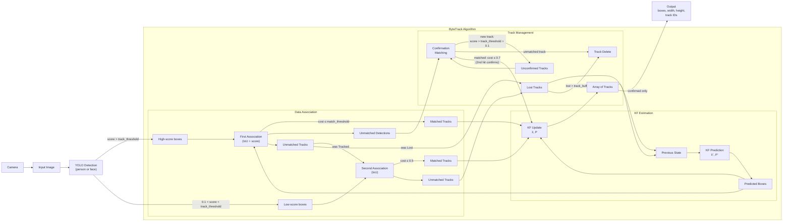

<div align="center">
<h1>DEC Common Utilities</h1>
</div>

<div align="center">
  
</div>

The **DEC Common** package holds the C++ code shared by the pepper4dec nodes: the lifecycle base class for the camera-driven perception nodes, a ByteTrack multi-object tracker, a parameter-loading helper and a standard `main()` runner. It ships no nodes of its own; other packages link against it.

## ✨ Key Features
- **ROS2 Native**: Built for ROS2 Humble
- **Camera lifecycle base**: topic resolution, synchronized color/depth subscriptions (raw or compressed), depth decoding and debug visualization for `face_detection` and `person_detection`
- **ByteTrack tracker**: a C++ port of `supervision`'s ByteTrack (two-stage IoU association, constant-velocity Kalman filter, Hungarian assignment) for persistent track IDs
- **Parameter helper**: declare-and-read in one call; a wrong-typed value fails node startup instead of being ignored
- **Node runner**: one `main()` for every node (init, spin, shutdown), with a single- or multi-threaded executor

## ✅ Prerequisites
- **ROS2 Humble** or newer
- **Eigen3**, **OpenCV**, **yaml-cpp**
- **cv_bridge**, **message_filters**

## 🛠️ Installation

### Package Installation

```bash
cd ~/ros2_ws
colcon build --packages-select dec_common
source install/setup.bash
```

Packages that depend on it (`face_detection`, `person_detection`, `animate_behavior`, `gesture_execution`, `behavior_controller`) pull it in automatically when built with `--packages-up-to`.

## 🚀 Running

Nothing to run. Link one of the two exported targets from a dependent package:

| Target | Contents | Link it when |
|---|---|---|
| `dec_common::dec_common` | the whole library: camera base, ByteTrack, parameter helper | the node uses the camera base or the tracker |
| `dec_common::dec_common_runner` | `node_runner.h` only (header-only, depends on `rclcpp` alone) | the node only needs the standard `main()` |

```cmake
find_package(dec_common REQUIRED)
target_link_libraries(my_node dec_common::dec_common_runner)
```

## 🔌 API

| Header | Provides |
|---|---|
| `dec_common/camera_lifecycle_node.h` | `CameraLifecycleNode`, the lifecycle base for camera nodes, and `CameraNodeBehavior`, which holds the deliberate differences between them (depth statistic, debug-image gating, quit key). It does not override the lifecycle callbacks: derived nodes keep their own configure/activate logic and call its helpers |
| `dec_common/byte_tracker.h` | `byte_tracker::ByteTrack`: `updateWithDetections(Detections)` returns the detections with `tracker_id` filled in and drops unmatched ones; `reset()` clears all tracks |
| `dec_common/param_loader.h` | `dec_common::declareAndGetParameter<T>(node, name, default)` |
| `dec_common/node_runner.h` | `runNode<NodeT>(argc, argv, options, extra_nodes, after_spin)`; `NodeRunOptions` sets the startup banner, logger name and executor thread count |

## 📁 Package Structure

```
dec_common/
├── include/dec_common/
│   ├── camera_lifecycle_node.h   # lifecycle base for the camera nodes
│   ├── byte_tracker.h            # ByteTrack multi-object tracker
│   ├── param_loader.h            # declareAndGetParameter()
│   └── node_runner.h             # runNode(), header-only
├── src/
│   ├── camera_lifecycle_node.cpp
│   └── byte_tracker.cpp
├── test/
│   └── test_byte_tracker.cpp     # gtest, synthetic detections only
├── CMakeLists.txt
├── package.xml
└── README.md
```

## 🏗️ Architecture

### ByteTrack Tracker

The tracker (`src/byte_tracker.cpp`) implements `supervision`'s ByteTrack algorithm, built from three components: **data association** — ByteTrack's two-stage association (Hungarian assignment over IoU cost matrices); **Kalman filter estimation** — an 8-state constant-velocity filter per track over the bounding box center `(x, y)`, aspect ratio, height, and their velocities; and **track management** — the Unconfirmed → Tracked → Lost → Removed lifecycle, including the matching step that confirms or discards unconfirmed tracks.



Each frame, the previous frame's tracks (Array of Tracks plus Lost Tracks) are KF-predicted forward and associated against the new YOLO detections; every match becomes a KF update back into the array, and only confirmed tracks are published. Edge labels carry the gate for each transition; the matching cost is `1 − IoU` (score-fused in the first association and confirmation matching).

- **First Association** matches the high-score boxes against all Tracked *and* Lost tracks (IoU fused with detection confidence). Including Lost tracks is what lets an occluded person be re-found under their old ID.
- **Second Association** is the low-score rescue: tracks that went unmatched but **were Tracked** last frame probably just dipped in confidence (partial occlusion, blur), so they get a second chance against the low-score boxes. Tracks that **were Lost** already get no second chance — matching a stale, coasted box to a weak detection risks an identity switch — so they simply stay Lost.
- **Confirmation Matching** is the entrance exam for new tracks. Detections nobody claimed are matched against last frame's unconfirmed tracks: a match confirms the track (it gets its ID and is published from now on), a failed unconfirmed track is deleted immediately as a one-frame false positive, and remaining detections scoring above `track_threshold + 0.1` initialize the next batch of unconfirmed tracks.
- **Lost tracks** coast on KF prediction for up to `track_buffer` frames before Track Delete removes them; while coasting they keep re-entering the First Association.

One detail is omitted from the diagram for readability: after each frame, Tracked and Lost tracks that overlap heavily are de-duplicated, keeping the older track.

## 🧪 Testing

```bash
cd ~/ros2_ws
colcon test --packages-select dec_common
colcon test-result --verbose
```

`test_byte_tracker` checks the Hungarian assignment and IoU helpers against hand-computed matrices, and the full tracker against synthetic detection sequences: stable IDs while tracking, IDs kept through short occlusions, and low-confidence filtering. It needs no ROS graph, camera or model.

## 💡 Support

For issues or questions:
- Create an issue on the [pepper4dec GitHub repository](https://github.com/yohatad/pepper4dec/issues)
- Contact: <a href="mailto:yohatad123@gmail.com">yohatad123@gmail.com</a>

## 📜 License
Copyright (C) 2025 Carnegie Mellon University Africa
Licensed under the BSD-3-Clause License. See individual package licenses for details.
