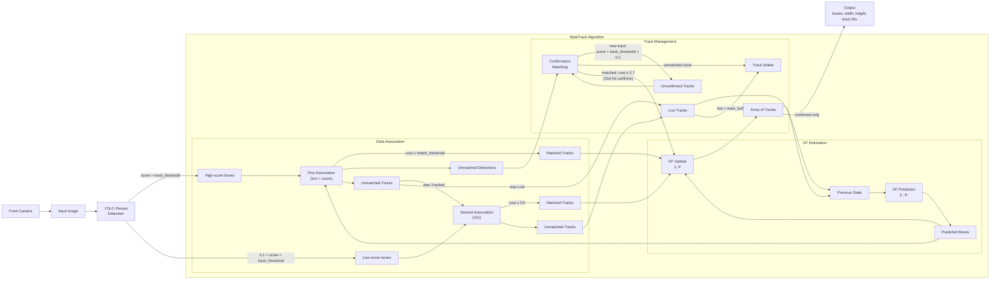

<div align="center">
<h1>Person Detection and Tracking</h1>
</div>

<div align="center">
  
</div>

The **Person Detection and Tracking** package is a ROS2 package designed to detect and track multiple persons in real-time by subscribing to image topics. It publishes an array of detected persons with their bounding boxes, labels, and tracking IDs to the `/person_detection/data` topic. Each entry includes the label, centroid coordinates, bounding box dimensions, and a unique tracking ID for maintaining identity across frames.

## ✨ Key Features
- **ROS2 Native**: Built for ROS2 Humble
- **YOLO-based Detection**: Uses state-of-the-art YOLO models for person detection
- **ByteTrack Tracking**: Multi-person tracking with ByteTrack algorithm
- **Real-time Processing**: Processes synchronized RGB-D camera streams
- **Configurable**: Configuration via YAML file
- **Multi-camera Support**: RealSense and Pepper camera support
- **ROS2 Bag Compatible**: Optional camera launch for use with recorded data

## ✅ Prerequisites
- **ROS2 Humble** or newer
- **CUDA-capable GPU** (recommended for optimal performance; falls back to CPU automatically)
- **Intel RealSense camera** (if using RealSense) with USB 3.0 connection

## 🛠️ Installation

### Package Installation

```bash
# Clone the repository (if not already done)
cd ~/ros2_ws/src
git clone https://github.com/yohatad/pepper4dec.git

# Build the workspace (pulls in the dec_interfaces/dec_common dependencies automatically)
cd ~/ros2_ws
colcon build --packages-up-to person_detection
source install/setup.bash
```

### Model Files

Download the required ONNX model files to the `models/` directory:
- `person_detection_yolov11m.onnx` - YOLOv11 detection model (or other YOLO variant)

## 🔧 Configuration

Configuration is managed via ROS2 parameters, loaded from `config/person_detection_configuration.yaml`
(`ros2 param get/set /person_detection <name>` also works at runtime):

| Parameter | Description | Default |
|-----------|-------------|---------|
| `camera` | Camera type to use (`realsense`, `pepper`, or `video`) | `pepper` |
| `use_compressed` | Use compressed ROS image topics | `false` |
| `confidence_threshold` | Confidence threshold for person detection | `0.6` |
| `target_classes` | List of target classes to detect (or `all`) | `[person]` |
| `track_threshold` | Confidence threshold for tracking (ByteTrack) | `0.45` |
| `track_buffer` | Number of frames to keep lost tracks before removing | `30` |
| `match_threshold` | IoU threshold for matching detections to tracks | `0.8` |
| `frame_rate` | Expected frame rate of the video stream (fps) | `30` |
| `image_timeout` | Timeout for shutting down after video ends (s) | `2.0` |
| `verbose_mode` | Enable visualization and detailed logging | `false` |

> **Note:** Enabling `verbose_mode` (`true`) activates real-time visualization via OpenCV windows.

## 🚀 Running the Node

```bash
# Source the workspace
source ~/ros2_ws/install/setup.bash

# Launch with default configuration (RealSense camera)
ros2 launch person_detection person_detection_launch_robot.launch.py

# Using ROS2 bag data (disable camera launch)
ros2 launch person_detection person_detection_launch_robot.launch.py launch_camera:=false
```

### Manual Node Execution

```bash
# Start Camera Driver (if not using bags)
ros2 run realsense2_camera realsense2_camera_node \
  --ros-args \
  -p rgb_camera.color_profile:=640x480x15 \
  -p depth_module.depth_profile:=640x480x15 \
  -p align_depth.enable:=true \
  -p enable_sync:=true

# Start Person Detection Node
ros2 run person_detection person_detection
```

Both this and the launch file above start the node unconfigured. Transition it
manually with `ros2 lifecycle set /person_detection configure` then
`... activate`, or launch the whole stack via `dec_launch`'s
`dec_system.launch.py`, which drives these transitions automatically through
`nav2_lifecycle_manager`.

## 🖥️ ROS Interface

### Subscribed Topics

| Topic | Type | Description |
|-------|------|-------------|
| `/camera/color/image_raw` | `sensor_msgs/Image` | Color image from camera |
| `/camera/aligned_depth_to_color/image_raw` | `sensor_msgs/Image` | Depth image |

### Published Topics

| Topic | Type | Description |
|-------|------|-------------|
| `/person_detection/data` | `dec_interfaces/msg/PersonDetection` | Detected persons with tracking IDs |
| `/person_detection/debug` | `sensor_msgs/Image` | Debug RGB image with detection overlays |
| `/person_detection/depth_debug` | `sensor_msgs/Image` | Debug colorized depth image |

## 📨 Message Structure

### `/person_detection/data` (`dec_interfaces/msg/PersonDetection`)

| Field | Type | Description |
|-------|------|-------------|
| `person_label_id[]` | string[] | Array of unique tracking IDs |
| `class_names[]` | string[] | Array of class names (always `person`) |
| `class_ids[]` | int32[] | Array of COCO class IDs (always `0`) |
| `confidences[]` | float32[] | Array of detection confidence scores |
| `centroids[]` | `geometry_msgs/Point[]` | Array of centroid coordinates (z = depth in meters) |
| `width[]` | float32[] | Array of bounding box widths |
| `height[]` | float32[] | Array of bounding box heights |

## 📁 Package Structure

```
person_detection/
├── config/
│   └── person_detection_configuration.yaml         # ROS2 parameters
├── data/
│   └── pepper_topics.yaml                          # topic name overrides
├── launch/
│   └── person_detection_launch_robot.launch.py
├── models/
│   └── person_detection_yolov11m.onnx              # YOLOv11m detector weights
├── include/person_detection/
│   ├── byte_tracker.h
│   └── person_detection_interface.h                # node/class declarations
├── src/
│   ├── byte_tracker.cpp
│   ├── person_detection_application.cpp            # node entry point (main)
│   └── person_detection_implementation.cpp         # YOLO inference + ByteTrack
├── CMakeLists.txt
├── package.xml
└── README.md
```

## 🏗️ Architecture

The person detection system consists of two main components:

1. **Camera Driver**: Provides synchronized RGB-D image streams
2. **Person Detection Node**:
   - Receives image streams from the camera
   - Performs person detection using YOLO model
   - Tracks persons across frames using ByteTrack algorithm
   - Publishes person detection results

### ByteTrack Tracker

The tracker (`byte_tracker.cpp`) is a C++ port of `supervision`'s ByteTrack, built from three components: **data association** — ByteTrack's two-stage association (Hungarian assignment over IoU cost matrices); **Kalman filter estimation** — an 8-state constant-velocity filter per track over the bounding box center `(x, y)`, aspect ratio, height, and their velocities; and **track management** — the Unconfirmed → Tracked → Lost → Removed lifecycle, including the matching step that confirms or discards unconfirmed tracks.



Each frame, the previous frame's tracks (Array of Tracks plus Lost Tracks) are KF-predicted forward and associated against the new YOLO detections; every match becomes a KF update back into the array, and only confirmed tracks are published. Edge labels carry the gate for each transition; the matching cost is `1 − IoU` (score-fused in the first association and confirmation matching).

- **First Association** matches the high-score boxes against all Tracked *and* Lost tracks (IoU fused with detection confidence). Including Lost tracks is what lets an occluded person be re-found under their old ID.
- **Second Association** is the low-score rescue: tracks that went unmatched but **were Tracked** last frame probably just dipped in confidence (partial occlusion, blur), so they get a second chance against the low-score boxes. Tracks that **were Lost** already get no second chance — matching a stale, coasted box to a weak detection risks an identity switch — so they simply stay Lost.
- **Confirmation Matching** is the entrance exam for new tracks. Detections nobody claimed are matched against last frame's unconfirmed tracks: a match confirms the track (it gets its ID and is published from now on), a failed unconfirmed track is deleted immediately as a one-frame false positive, and remaining detections scoring above `track_threshold + 0.1` initialize the next batch of unconfirmed tracks.
- **Lost tracks** coast on KF prediction for up to `track_buffer` frames before Track Delete removes them; while coasting they keep re-entering the First Association.

One detail is omitted from the diagram for readability: after each frame, Tracked and Lost tracks that overlap heavily are de-duplicated, keeping the older track.

## 🧪 Testing

```bash
# Check node is running
ros2 node list

# Monitor person detection output
ros2 topic echo /person_detection/data

# Verify topics
ros2 topic list
```

## 💡 Support

For issues or questions:
- Create an issue on the [pepper4dec GitHub repository](https://github.com/yohatad/pepper4dec/issues)
- Contact: <a href="mailto:yohatad123@gmail.com">yohatad123@gmail.com</a>

## 📜 License
Copyright (C) 2026 Upanzi Network
Licensed under the BSD-3-Clause License. See individual package licenses for details.