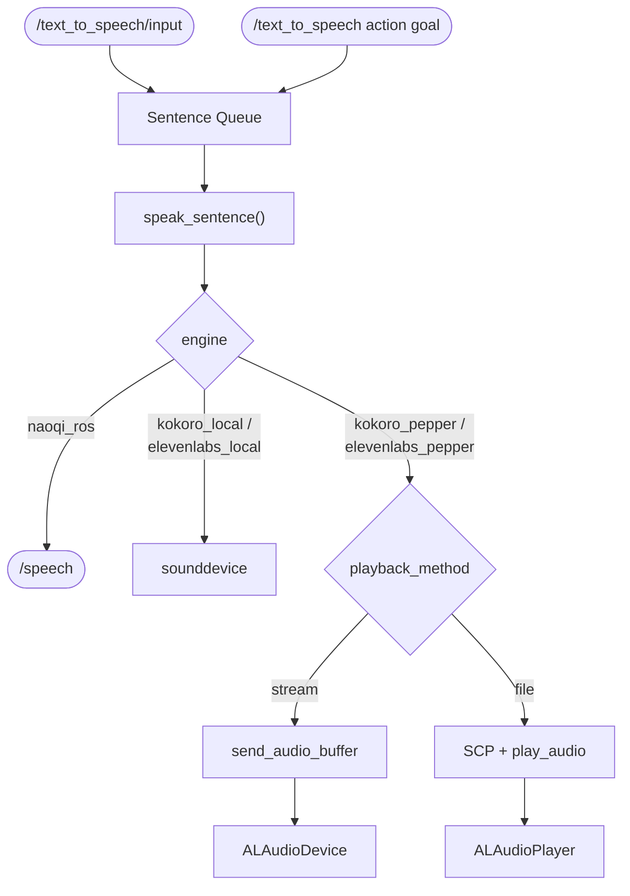
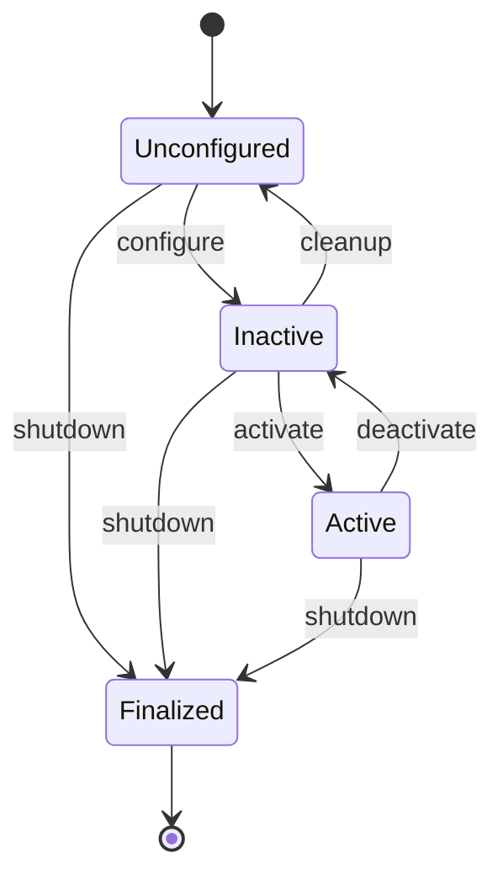

<div align="center">
<h1>Text-to-Speech (TTS)</h1>
</div>

<div align="center">
  
</div>

The **Text-to-Speech (TTS)** package is a ROS2 package designed to synthesize and play speech on the Pepper robot. It receives text sentences on `/text_to_speech/input` and speaks them as they arrive — enabling Pepper to start talking before the LLM has finished generating the full response. The package supports multiple synthesis backends including naoqi_ros, Kokoro-82M, and ElevenLabs with both streaming and file-based playback methods.

## ✨ Key Features
- **ROS2 Native**: Built for ROS2 Humble
- **Five Backend Options**: naoqi_ros, kokoro_local, kokoro_pepper, elevenlabs_local, elevenlabs_pepper
- **Two Playback Methods**: stream (PCM chunks via ALAudioDevice) and file (SCP + ALAudioPlayer action)
- **ElevenLabs Streaming**: Audio starts playing within ~200 ms of the first API chunk
- **Sentence Queue**: Background playback thread ensures strict ordering
- **Microphone Muting**: Automatic mic control during playback
- **ROS2 Action Server**: `/text_to_speech` action for programmatic TTS calls with completion feedback

## ✅ Prerequisites
- **ROS2 Humble** or newer
- **Python 3.10** or compatible version
- **Pepper Robot** (for naoqi_ros, kokoro_pepper, elevenlabs_pepper backends)
- **espeak-ng** (for Kokoro phonemiser)

## 🛠️ Installation

### Package Installation

```bash
# Clone the repository (if not already done)
cd ~/ros2_ws/src
git clone https://github.com/yohatad/pepper4dec.git

# Build the workspace
cd ~/ros2_ws
colcon build --packages-select text_to_speech
source install/setup.bash
```

### Python Dependencies

```bash
# Core (all backends)
pip install kokoro soundfile sounddevice scipy

# ElevenLabs backend only
pip install elevenlabs

# espeak-ng for Kokoro phonemiser
sudo apt-get install espeak-ng
```

## 🔧 Configuration

Configuration is managed via `config/text_to_speech_configuration.yaml`.

### Backend Selection

| `engine` value | Synthesis | Playback |
|----------------|-----------|----------|
| `naoqi_ros` | Pepper on-board ALTextToSpeech | Pepper speakers (no extra deps) |
| `kokoro_local` | Kokoro-82M (local GPU/CPU) | Laptop speakers via sounddevice |
| `kokoro_pepper` | Kokoro-82M (local GPU/CPU) | Pepper speakers via naoqi_driver |
| `elevenlabs_local` | ElevenLabs API (streaming) | Laptop speakers via sounddevice |
| `elevenlabs_pepper` | ElevenLabs API (streaming) | Pepper speakers via naoqi_driver |

### Playback Method (pepper backends only)

| `playback_method` | How it works | Requirements |
|-------------------|--------------|--------------|
| `stream` | Raw PCM chunks → ALAudioDevice.sendRemoteBufferToOutput (no SCP) | None |
| `file` | SCP WAV to robot → ALAudioPlayer.loadFile → play_audio action | Passwordless SSH key to robot |

### All Parameters

| Parameter | Description | Default |
|-----------|-------------|---------|
| `engine` | Synthesis + playback backend | `naoqi_ros` |
| `playback_method` | `stream` or `file` (pepper backends only) | `stream` |
| `naoqi_speech_topic` | ROS topic for naoqi_bridge (naoqi_ros only) | `/speech` |
| `chars_per_second` | Estimated speaking rate for duration estimation | `12.0` |
| `speech_padding_s` | Extra wait after estimated speech end | `0.5` |
| `voice` | Kokoro-82M voice name (af_bella, af_heart, …) | `af_bella` |
| `sample_rate` | Synthesis sample rate in Hz | `24000` |
| `output_device` | sounddevice output device index (-1 = system default) | `-1` |
| `stream_volume` | PCM amplitude multiplier for stream mode | `1.0` |
| `elevenlabs_api_key` | ElevenLabs API key | `""` |
| `elevenlabs_voice_id` | ElevenLabs voice ID | `21m00Tcm4TlvDq8ikWAM` (Rachel) |
| `elevenlabs_model` | ElevenLabs model ID | `eleven_turbo_v2_5` |
| `elevenlabs_stability` | ElevenLabs voice stability (0.0–1.0) | `0.5` |
| `elevenlabs_similarity_boost` | ElevenLabs similarity boost (0.0–1.0) | `0.75` |
| `elevenlabs_style` | ElevenLabs style exaggeration (0.0–1.0) | `0.0` |
| `elevenlabs_speed` | ElevenLabs speaking speed multiplier | `1.0` |

## 🚀 Running the Node

```bash
# Source the workspace
source ~/ros2_ws/install/setup.bash

# Run the TTS node
ros2 run text_to_speech text_to_speech
```

### Sending Text

```bash
# Generic input topic (any source)
ros2 topic pub --once /text_to_speech/input std_msgs/String 'data: "Hello, I am Pepper."'

# Programmatic call via action server (blocks until speech is complete)
ros2 action send_goal /text_to_speech dec_interfaces/action/TTS "{text: 'Hello, how can I help you?'}"
```

## 🖥️ ROS Interface

### Subscribed Topics

| Topic | Type | Description |
|-------|------|-------------|
| `/text_to_speech/input` | `std_msgs/String` | Text to speak — accepts sentences from any source |

### Published Topics

| Topic | Type | Description |
|-------|------|-------------|
| `/text_to_speech/speaking` | `std_msgs/Bool` | `True` while Pepper is speaking |
| `/speech` | `std_msgs/String` | Text forwarded to NAOqi TTS (naoqi_ros backend only) |

### Action Servers

| Action | Type | Description |
|--------|------|-------------|
| `/text_to_speech` | `dec_interfaces/action/TTS` | Speak text and block until complete |

### Service Clients

| Service | Type | Used when |
|---------|------|----------|
| `/speech_event/set_enabled` | `std_srvs/SetBool` | Mute/unmute mic during playback |
| `/naoqi_driver/load_audio_file` | `naoqi_bridge_msgs/srv/LoadAudioFile` | `file` playback mode |
| `/naoqi_driver/unload_audio_file` | `naoqi_bridge_msgs/srv/UnloadAudioFile` | `file` playback mode |
| `/naoqi_driver/send_audio_buffer` | `naoqi_bridge_msgs/srv/SendAudioBuffer` | `stream` playback mode |

### Action Clients

| Action | Type | Used when |
|--------|------|----------|
| `/naoqi_driver/play_audio` | `naoqi_bridge_msgs/action/PlayAudio` | `file` playback mode |

## 🔌 Action Interface

**Action Type:** `dec_interfaces/action/TTS`

### Goal

| Field | Type | Description |
|-------|------|-------------|
| `text` | string | Text to speak |

### Result

| Field | Type | Description |
|-------|------|-------------|
| `success` | bool | Whether speech completed successfully |
| `message` | string | Status message |

### Feedback

| Field | Type | Description |
|-------|------|-------------|
| `status` | string | "queuing" (sentences being enqueued), "speaking" (audio actively playing) |

## 🏗️ Architecture



### Node Lifecycle

`TextToSpeechNode` is a `LifecycleNode`; `dec_launch`'s `nav2_lifecycle_manager` drives it through these transitions on startup. Several steps are gated by `engine` — see the table below.



| Transition | What happens |
|---|---|
| `configure` | Create the sentence queue/state; warm up Kokoro (`kokoro_local`/`kokoro_pepper` only); create the local `AudioPlayer` (`kokoro_local`/`elevenlabs_local` only); create the `/text_to_speech/speaking` publisher (+ NAOqi speech topic publisher for `naoqi_ros`); create the mic-mute client, and the pepper-backend load/unload/send-buffer/play_audio clients (`kokoro_pepper`/`elevenlabs_pepper` only); create the `/text_to_speech` action server |
| `activate` | Subscribe to `/text_to_speech/input`, start the background playback thread |
| `deactivate` | Stop the playback thread, drain the sentence queue, destroy the subscription |
| `cleanup` | Destroy publishers/clients/action server (engine-dependent, mirroring `configure`), release the audio player |
| `shutdown` | Log shutdown and exit (reachable from any state) |

## 🧪 Testing

```bash
# Check node is running
ros2 node list

# Verify action server is available
ros2 action list

# Send a test message
ros2 topic pub --once /text_to_speech/input std_msgs/String 'data: "Hello, I am Pepper."'

# Test via action server
ros2 action send_goal /text_to_speech dec_interfaces/action/TTS "{text: 'Hello, how can I help you?'}"
```

### Testing Audio Playback Directly

```bash
cd ~/ros2_ws/src/pepper4dec/text_to_speech

# Stream mode (robot speakers)
~/ros2_ws/.venvs/tts_virtual_env/bin/python3 tests/test_play_audio.py "Hello." --method stream

# File mode (robot speakers, requires SSH key)
~/ros2_ws/.venvs/tts_virtual_env/bin/python3 tests/test_play_audio.py "Hello." --method file

# Local speakers only
~/ros2_ws/.venvs/tts_virtual_env/bin/python3 tests/test_play_audio.py "Hello." --local
```

## 📁 Package Structure

```
text_to_speech/
├── config/
│   └── text_to_speech_configuration.yaml     # ROS2 parameters
├── data/
│   └── pepper_topics.yaml                    # topic name overrides
├── launch/
│   └── text_to_speech_launch_robot.launch.py
├── scripts/
│   └── text_to_speech                        # venv launcher for `ros2 run`
├── resource/
│   └── text_to_speech
├── tests/
│   └── test_play_audio.py                    # manual playback test script
├── text_to_speech/
│   ├── __init__.py
│   ├── text_to_speech_application.py         # node entry point, lifecycle node
│   └── text_to_speech_implementation.py      # synthesis/playback backend helpers
├── package.xml
├── setup.py
├── setup.cfg
├── requirements.txt
└── README.md
```

## 💡 Support

For issues or questions:
- Create an issue on the [pepper4dec GitHub repository](https://github.com/yohatad/pepper4dec/issues)
- Contact: <a href="mailto:yohatad123@gmail.com">yohatad123@gmail.com</a>

## 📜 License
Copyright (C) 2026 Upanzi Network
Licensed under the BSD-3-Clause License. See individual package licenses for details.
